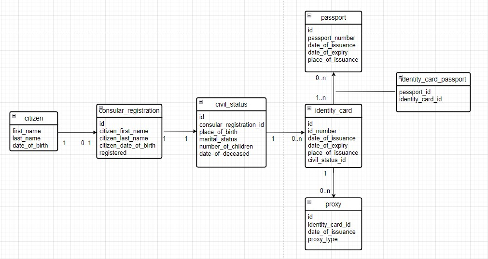

# Design Document - "Consulate-Database-Project"
## Scope
This database allows the U.S Consulate staff to identify American citizens who live in Belgium including the ones born here. Also, its helps to keep track of every citizen, update their information and issue documents including IDs, passports, proxies and so forth. 

This database concerns only American citizens who reside permanently or for a lengthy period on the Belgian soil including students, permanent residents and newborns. It also includes some American tourists who either lost their identity documents or passed away on the Belgian soil.

The database excludes the following cases:

* American tourists who are only visiting Belgium for tourism 

* Non-American citizens who apply for visas

* American diplomats, special agents and military personnel

* Non American partners of U.S citizens

## Functional Requirements

The users, in this case, are administrative clerks at the U.S Consulate who can: 

* Check if a citizen is already registered or not

* Verify the presence of all details about a citizen

* Consult IDs, passports and proxies issued within this specific consulate by a U.S citizen

* Update citizen’s addresses, marital status, job title, passport, etc

* Issue new documents based on the stored data in case of renewal, theft, lost, etc

* Identify deceased U.S citizens on Belgian soils

* Warn U.S citizens of any hazards

* Register American newborns in the civil status register

The following elements are excluded from this database

* American citizens who are registered within the Europe union

* Check an American citizen’s marital status in the U.S

* Consult a citizen address and other personal details in the U.S

* Check a citizen criminal register in the U.S

* Identify American citizen who left Belgium

### Entities and Relationships

This entity relationship diagram presents an overview of the designed tables and their attributes. Moreover, the relationships between tables are mentioned including the third table which designates the presence of many-to-many relationship between two tables.

## Entity Relationship Diagram

### Entities relationships

Description of relationships:

* A citizen can be registered or not yet at the consulate. So, he/she has a 0 to 1 relationship with the consular_registration table. If he/she is not yet registered, it is then a 0; whereas if he/she is already registered, it is then a 1. Each citizen has a maximum of 1 registration. 

* If a citizen is registered at the consulate, it means that he/she is uniquely registered in civil status. So, the relationship between consular_registration and civil_status tables is 1 to 1 relationship. A citizen can only be registered in civil status register 1 time in his/her life.

* When a citizen is older 12 years old, he/she can apply for an American ID. Every ID has a unique serial number; however, it changes if in case of renewal, lost or theft. So, a registered citizen can have 0 to many identity cards. This is why I set the relationship between civil_status and identity_card tables to one-to-zero-or-many relationship.

* Every registered citizen with an identity card can apply for 0 to many passports with different serial numbers. And a passport can have at least one or many identity cards linked to it. So, in this case, a third entity-identity_card_passport- is created to designate many-to-many relationship between passport and identity_card tables. 

* A citizen can request zero to many proxies, and every proxy belongs to only 1 identity card. Thus, this implies a one-to-zero-or-many relationship between proxy and identity_card tables.
## Representation
## Entities

To attain the desired purpose behind the creation of this database, I am inclined to include the following entities into my schema: 

**citizen**

The citizen table is composed of the following:

`first_name`: denotes the first name of the citizen. Its data type is set to `VARCHAR(255)`. This attribute has a `NOT NULL` constraint, and also belongs to a `COMPOISTE KEY`.

`last_name`: denotes the last name of the citizen. Its data type is set to `VARCHAR(255)`. This attribute has a `NOT NULL` constraint, and also belongs to a `COMPOISTE KEY`.

`date_of_birth`: denotes the date when the citizen was born. Its date type is set to `DATE`. This attribute has a NOT NULL constraint, and also belongs to a `COMPOISTE KEY`.

This column has a `COMPOSITE PRIMARY KEY` that includes `first_name`, `last_name` and `date_of_ birth` to uniquely identify a specific citizen. Having only `first_name` and `last_name`; without a `date_of_birth` as a `COMPOSITE KEY` may result in more than one citizen.

**consular_registration**

The consular_registration table is composed of the following:

`id`: designates the consular registration number of a citizen within the consulate. Its data type is an `INTEGER` and has `AUTO_INCREMENT` keyword as a feature. This attribute has a `PRIMARY KEY` which is `UNIQUE` and `NOT NULL` by default.

`citizen_first_name`: refers to the first name of the citizen. Its data type is set to `VARCHAR(255)`. This attribute has a FOREIGN KEY which is linked to a `COMPOSITE KEY` in citizen table.

`citizen_last_name`: refers to the first last of the citizen. Its data type is set to `VARCHAR(255)`. This attribute has a `FOREIGN KEY` which is linked to a `COMPOSITE KEY` in citizen table.

`citizen_date_of_birth`: refers to a citizen's birthplace. Its data type is set to `DATE`. This attribute has a `FOREIGN KEY` which is linked to a `COMPOSITE KEY` in the citizen table.

`registered`: refers to a citizen who is either registered or not at the consulate. Its data type is a `Boolean` that returns either `true` or `false`. This attribute has a `NOT NULL` value because we must know if the citizen is registered or not so as to access his/her information.

**civil_status**

The civil_status table is composed of the following:

`id`: refers to a citizen’s number within the civil status register. Its data type is an `INTEGER`. This attribute has a `PRIMARY KEY` which is by default `NOT NULL` and `UNIQUE`.

`consular_registration_id`: refers to consular registration number of a citizen. Its date type is an `INTEGER`. This attribute has a `FOREIGN KEY` which is by default `NOT NULL` and `UNIQUE`.

`place_of_birth`: refers to the place where a citizen was born. Its data type is a `DATE`. This attribute has a `NOT NULL` constraint because its entry is essential.  

`marital_status`: is to see if a citizen is single, divorced, widow, etc. its date type is a `VARCHAR(255)`. This attribute has a `NOT NULL` constraint to emphasize the importance of citizen’s situation.

`number_of_children`: refers to the number of children a citizen has or has not. Its data type is an `INTEGER`. This attribute has a `NOT NULL` constraint to know the exact number of children a citizen has and a zero value means he/she does not have.

`date_of_deceased`: refers to the date when a citizen has passed away on the Belgian soil. Its data type is a `DATE`. This attribute has a `DEFAULT` constraint of `NULL` in case no input is entered. 

**identity_card**

The identity_card table is composed of the following:

`id`: refers to a unique number that is given to citizen and has an `AUTO_INCREMENT` feature. Its data type is `INTEGER`. This attribute has a `PRIMARY` KEY which is `UNIQUE` and `NOT NULL` by default.

`id_number`: refers to the ID number printed on citizen’s ID. Its data type is `INTEGER`. This attribute has `UNIQUE` constraint because no other citizen can have the same ID number.

`date_of_issuance`: refers to date when the ID was issued. Its data type is an `INTEGER`. This attribute has `NOT NULL` constraint because it is an essential detail.

`date_of_expiry`: refers to date when the ID become expired and useless. Its data type is an `INTEGER`. This attribute has a `NOT NULL` constraint which a mandatory filed of data. 

`place_of_issuance`: refers to the place where the ID was issued.  Its data type is `VARCHAR(255)`. This attribute has a `NOT NULL` constraint because it contains necessary information.

`civil_status_id`: refers to the civil status table which contains extra information. Its data type is an `INTEGER`. This attribute has `FOREIGN KEY` which links it to the `civil_status` table. 

**passport**

The passport table is composed of the following:

`id`: refers to a unique number given to citizen and has an `AUT0_INCREMENT` feature. Its data type is an `INTEGER`. This attribute has a `PRIMARY KEY` constraint which is `UNIQUE` and `NOT NULL` by default.

`passport_number`: refers to serial number printed on citizen’s passport. Its data type is an `INTEGER`. This attribute has a `UNIQUE` constraint to denote that two citizens cannot have the same serial number. 

`date_of_issuance`: refers to date when the passport was issue. Its data type is `DATE`. This attribute has a `NOT NULL` constraint because an important information.

`date_of_expiry`: refers to the date when the passport will be expired. Its data type is `DATE`. This attribute has a `NOT NULL` constraint because it’s crucial information. 

`place_of_issuance`: refers to place where the passport was issued. Its data type is `VARCHAR(255)`. This attribute has a `NOT NULL` constraint because it’s crucial information.

**identity_card_passport**

This is a third created to designate many-to-many relation exists between passport and identity_card tables.

The identity_card_passport table is composed of the following:

`passport_id`: refers to the passport id. Its data type is an `INTEGER`. This attribute has a `FOREIGN KEY` constraint to link it to passport table.

`identity_card_id`: refers to id of the identity card. Its data type is an `INTEGER`. This attribute has a `FOREIGN KEY` constraint to link it to the identity card table.

**Proxy**

The proxy table is composed of the following:

`id`: refers to a unique proxy issued within the consulate with an `AUTO-INCREMET` feature. Its data type is an `INTEGER`. This attribute has a `PRIMARY KEY` constraint which is `UNIQUE` and `NOT NULL` by default.

`identity_card_id`: refers to the ID holder to whom this proxy was issued. Its data type is an `INTEGER`. This attribute has a `FOREIGN KEY` constraint to refer to `identity_card` table, and is set to `ON DELETE CASCADE` to be immediately deleted when the `PRIMARY KEY` is deleted.

`date_of_issuance`: refers to the date when a proxy was issued. Its data type is `DATE`. This attribute has a `NOT NULL` constraint because its entry is necessary.

`proxy_type`: refers to the type of a proxy and its purpose. Its data type is `TEXT`. This attribute has no constraint because its input is optional. 

## Optimizations

I created a view table called `registration_civil_status` table joining `consular_registration` and `civil_status` tables based on a common attribute to check `citizen_first_name`, `citizen_last_name` and their `date_of_deceased` on the condition that they passed away starting from the onset of 2020.

To facilitate the search for only registered citizen, I created an index name `idx_registered` on `registered` column on `consular_registration` table. Then I wrote a query to select only citizens who their registered status is `true`. This away I enhance the speed of my future searches. 

## Limitations

This database has its own drawbacks and limited in its effectiveness. If a citizen did not register at the consulate, it would be impossible to access his/her personal information locally. Besides, a proxy is related only one specific ID serial number, and in case the citizen renews his/her ID, it is no longer related to his/her new ID. He/she must bring list of all IDs serial number related to them to prove their identities. 
